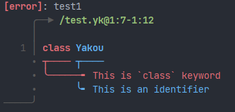

# Qilai

A Kotlin port of Java Library [Diagnose4J](https://github.com/Mesabloo/diagnose4j), 
also as port of Haskell Library [Diagnose](https://github.com/mesabloo/diagnose), 
which is an error-reporting library. 

## Usage
> There's no release currently.
